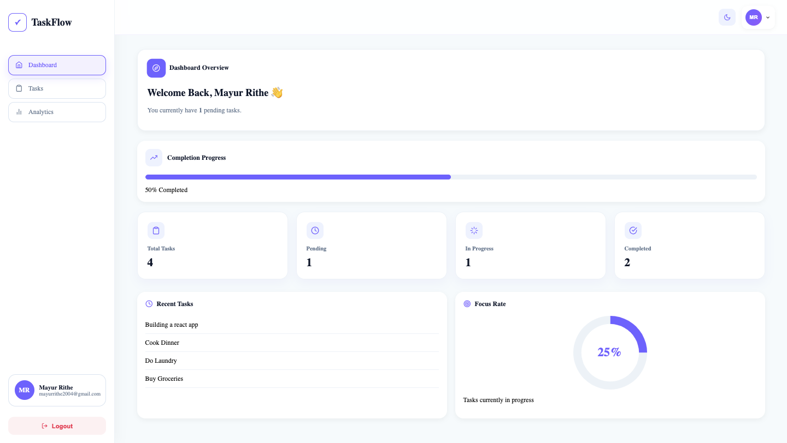
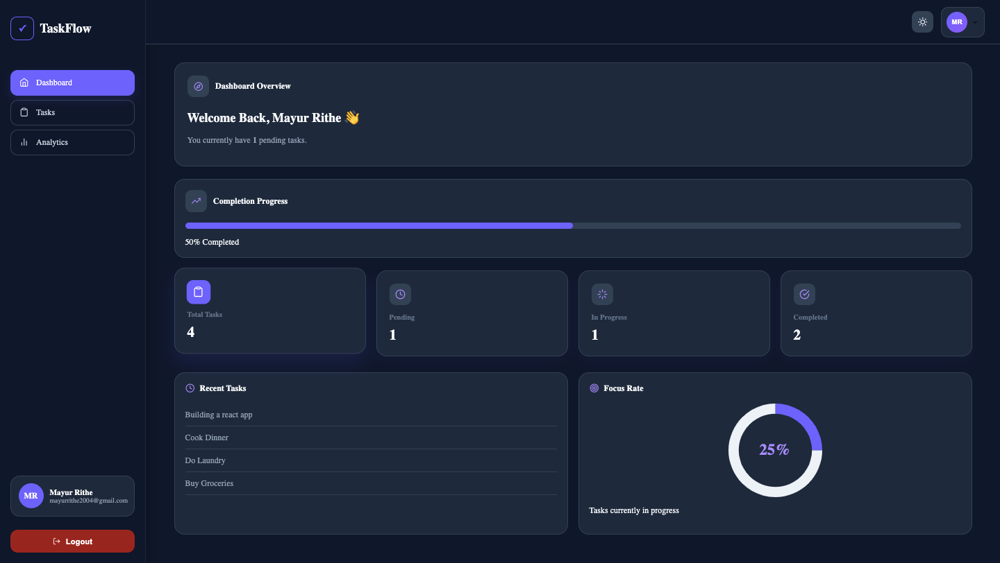
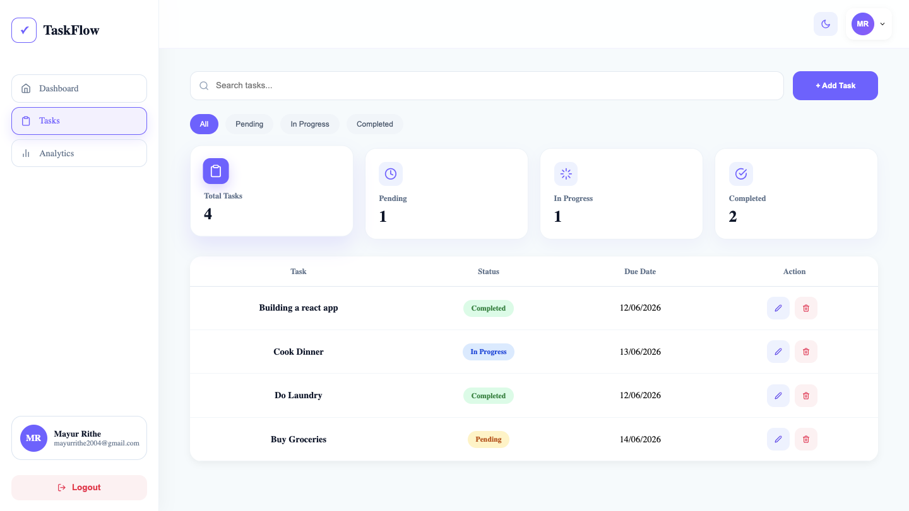
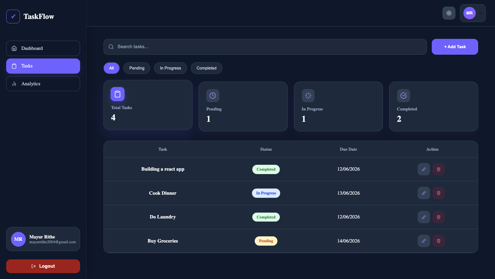
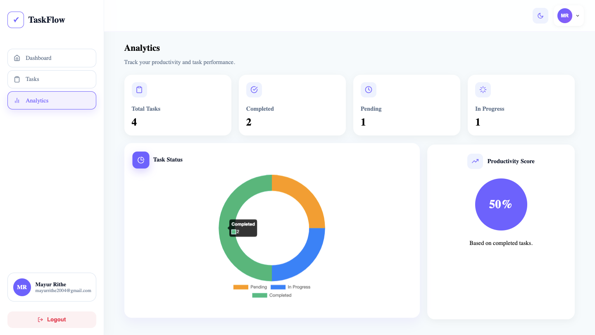
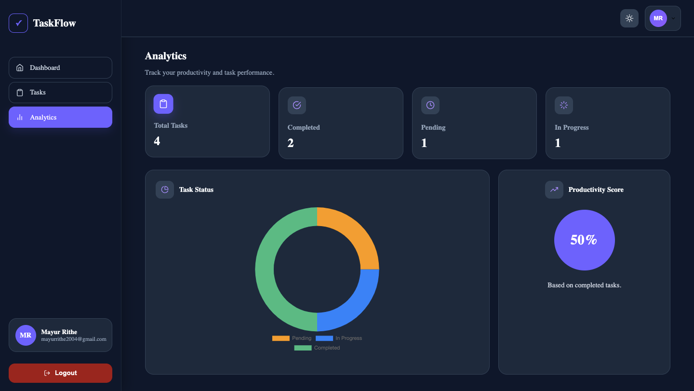
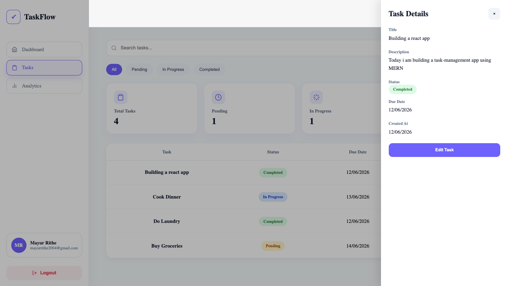
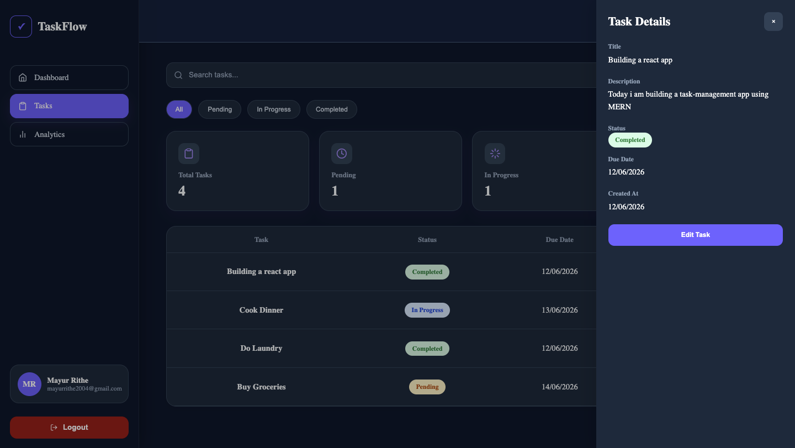
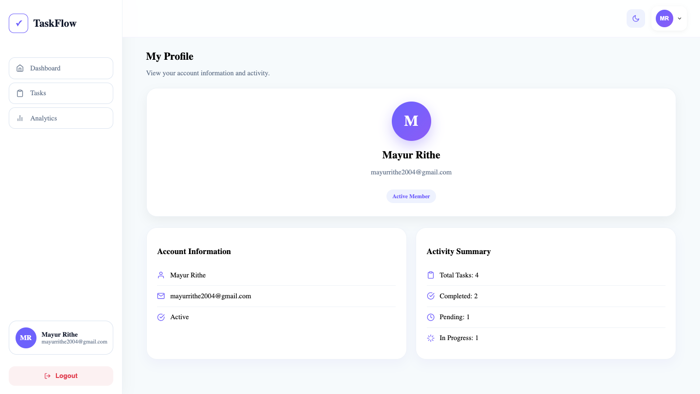
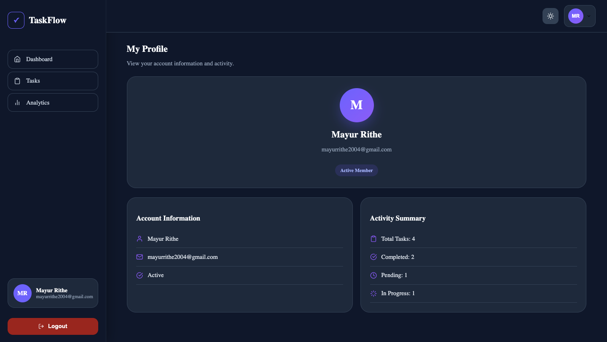

# TaskFlow - Task Management Application

A modern full-stack task management application built with the MERN Stack (MongoDB, Express.js, React.js, Node.js) that helps users organize, track, and manage daily tasks efficiently through a clean, responsive interface with analytics, task tracking, and dark mode support.

---

## 🌐 Live Demo

🔗 Live Website: https://task-management-webapp-0lsu.onrender.com

---

## 📖 Overview

TaskFlow is a full-stack task management platform designed to simplify task organization and productivity. Users can securely register and log in, create and manage tasks, track progress through different statuses, view analytics, and personalize their experience with dark mode support.

The application features JWT authentication, task analytics, search and filtering, responsive layouts, profile management, and a modern UI optimized for desktop, tablet, and mobile devices.

---

## ✨ Features

### Authentication & Security

- User Registration & Login
- JWT Authentication
- Protected Routes
- Secure Password Hashing with BcryptJS

---

### Task Management

- Create New Tasks
- Edit Existing Tasks
- Delete Tasks with Confirmation Modal
- Task Status Management
- View Task Details
- Task Drawer Interface

---

### Search & Filtering

- Search Tasks by Title
- Filter Tasks by Status
- Real-Time Search Results
- Dynamic Dashboard Updates

---

### Dashboard & Analytics

- Task Statistics Overview
- Total Tasks Counter
- Pending Tasks Counter
- In Progress Tasks Counter
- Completed Tasks Counter
- Analytics Dashboard

---

### User Experience

- Fully Responsive Design
- Mobile-Friendly Interface
- Dark Mode Support
- Modern UI/UX
- Smooth Animations
- Sidebar Navigation
- Profile Management

---

## 🛠️ Tech Stack

### Frontend

- React.js
- Vite
- React Router DOM
- Axios
- React Icons
- CSS3

### Backend

- Node.js
- Express.js
- JWT (jsonwebtoken)
- BcryptJS
- CORS

### Database

- MongoDB
- MongoDB Atlas
- Mongoose

### Development Tools

- Git & GitHub
- VS Code
- Postman

### Deployment

- Render (Frontend)
- Render (Backend)

---

## 📸 Screenshots

### Dashboard Preview

<table>
<tr>
<td align="center" width="50%">
<b>Light Mode</b><br><br>

</td>

<td align="center" width="50%">
<b>Dark Mode</b><br><br>

</td>
</tr>
</table>

### Tasks Preview

<table>
<tr>
<td align="center" width="50%">
<b>Light Mode</b><br><br>

</td>

<td align="center" width="50%">
<b>Dark Mode</b><br><br>

</td>
</tr>
</table>

### Analytics Preview

<table>
<tr>
<td align="center" width="50%">
<b>Light Mode</b><br><br>

</td>

<td align="center" width="50%">
<b>Dark Mode</b><br><br>

</td>
</tr>
</table>

### Detail Task Preview

<table>
<tr>
<td align="center" width="50%">
<b>Light Mode</b><br><br>

</td>

<td align="center" width="50%">
<b>Dark Mode</b><br><br>

</td>
</tr>
</table>

### Profile Preview

<table>
<tr>
<td align="center" width="50%">
<b>Light Mode</b><br><br>

</td>

<td align="center" width="50%">
<b>Dark Mode</b><br><br>

</td>
</tr>
</table>

---

## 📂 Project Structure

```text
taskflow
│
├── client
│   ├── public
│   ├── src
│   │   ├── assets
│   │   ├── components
│   │   ├── layouts
│   │   ├── pages
│   │   ├── services
│   │   ├── Styles
│   │   ├── App.jsx
│   │   ├── main.jsx
│   │   └── index.css
│   │
│   ├── package.json
│   └── vite.config.js
│
├── server
│   ├── config
│   ├── controllers
│   ├── middleware
│   ├── models
│   ├── routes
│   ├── server.js
│   └── package.json
│
└── README.md
```

---

## 🚀 Getting Started

### Requirement

- Node.js (v18 or higher)
- npm
- MongoDB Atlas Account
- Git
- GitHub

---

### Clone Repository

```bash
git clone https://github.com/Mayur-Rithe-14/taskflow.git

cd taskflow
```

---

### Backend Setup

```bash
cd server

npm install
```

Create a `.env` file:

```env
PORT=5000
MONGO_URI=your_mongodb_connection_string
JWT_SECRET=your_secret_key
```

Start Backend:

```bash
npm run dev
```

Backend runs on:

```text
http://localhost:5000
```

---

### Frontend Setup

```bash
cd client

npm install
```

Create a `.env` file:

```env
VITE_API_URL=http://localhost:5000/api
```

Start Frontend:

```bash
npm run dev
```

Frontend runs on:

```text
http://localhost:5173
```

---

## API Endpoints

### Authentication

```http
POST /api/auth/register
POST /api/auth/login
```

### Tasks

```http
GET    /api/tasks
POST   /api/tasks
PUT    /api/tasks/:id
DELETE /api/tasks/:id
GET    /api/tasks/stats
```

### Users

```http
GET /api/user/profile
PUT /api/user/profile
```

---

## 🎨 Key Features Explained

### Task Dashboard

Displays task statistics and task list in a clean dashboard layout.

Features include:

- Total Tasks
- Pending Tasks
- In Progress Tasks
- Completed Tasks
- Quick Search
- Status Filtering

---

### Analytics

Provides visual insights into task performance and completion rates.

Includes:

- Task Distribution
- Progress Tracking
- Completion Statistics

---

### Task Management Workflow

Users can:

- Create Tasks
- Edit Tasks
- Delete Tasks
- View Task Details
- Update Task Status

Task statuses:

```text
Pending → In Progress → Completed
```

---

### Dark Mode

TaskFlow includes built-in dark mode support.

Benefits:

- Improved accessibility
- Better night-time usability
- Consistent styling across all pages

---

## 🚀 Deployment

### Frontend Deployment (Render)

Build Command:

```bash
npm install && npm run build
```

Publish Directory:

```text
dist
```

Environment Variable:

```env
VITE_API_URL=https://your-backend.onrender.com/api
```

---

### Backend Deployment (Render)

Build Command:

```bash
npm install
```

Start Command:

```bash
npm start
```

Environment Variables:

```env
PORT=5000
MONGO_URI=your_mongodb_connection_string
JWT_SECRET=your_secret_key
```

---

## 🎯 Future Enhancements

- Task Categories & Tags
- Task Deadlines
- Email Notifications
- Team Collaboration
- File Attachments
- Task Comments
- Recurring Tasks
- Advanced Analytics
- Real-Time Updates
- Time Tracking

---

## 🔒 Security Features

- JWT Authentication
- Password Hashing using BcryptJS
- Protected Routes
- Secure API Access
- Environment Variable Configuration

---

## 📬 Contact

### Mayur Rithe

GitHub:
https://github.com/Mayur-Rithe-14

LinkedIn:
https://linkedin.com/in/mayur-rithe

Portfolio:
https://personal-portfolio-1-cqic.onrender.com

---

Built with ❤️ using the MERN Stack by Mayur Rithe.
